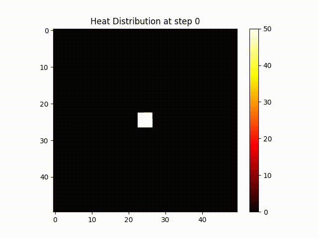

# MicroHEAT

A 2d FDTD heat diffusion simuation wrapped in a Web API



Useful for:

- Virtual [Home Assistant](https://www.home-assistant.io/) Testing
- Heat strategies using sensors and thermostats
- Logging and python program development (sample included)

**Quickstart:**

```sh
# (optional) create a virtual env
python3 -m venv .venv
source .venv/bin/activate
pip install -r requirements.txt

# (optional) test model
python3 ./simulation.py
# (optional) create mp4 / gif
bash ./build_mp4.sh

# run aiohttp webserver
python3 ./server.py
# server running at http://localhost:8080
```

## Sample Heating System Agent

A sample heating "agent" or automation strategy is given in `sample_heat_agent.py` this will read the thermostat state and switch the heat on or off via the API

```sh
python3 ./sample_heat_agent.py
```

## Logging Sample Program

A sample logging program is included for teaching purposes:

```sh
# create a sqlite3 database db.sqlite3
python3 ./sample_logging.py

# dump database
echo .dump | sqlite3 db.sqlite3

```

## API endpoints

- http://localhost:8080/ - index.html
- http://localhost:8080/reset - reset sim
- http://localhost:8080/sensor - read sensor value
- http://localhost:8080/heat-source/on - switch heat source on
- http://localhost:8080/heat-source/off - switch heat source off
- http://localhost:8080/heat-source/temp/{temp} - set heat source temperature

## Future Work

- Exponential step function for the heating system
  - Switches on and comes up to temperaute
